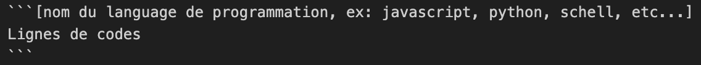

# Markdown - Le guide complet
Markdown est un langage de **mise en forme léger** créé par John Gruber en 2004. Il permet de rédiger du texte lisible et de le convertir facilement en HTML, idéal pour **notes, documents, wikis, blogs, README GitHub**, etc...

## Table des matières
1. [<u>Introduction</u>](#introduction)
2. [<u>Structure du texte</u>](#structure-du-texte)
   - Titres
   - Paragraphes
   - Sauts de ligne
   - Séparateurs Horizontaux
3. [<u>Mise en forme du texte</u>](#mise-en-forme-du-texte)
4. [<u>Listes</u>](#listes)
   - Listes à puces
   - Listes numérotées
   - Listes imbriquées
5. [<u>Liens et images</u>](#liens-et-images)
6. [<u>Code et syntaxe</u>](#code-et-syntaxe)
   - Inline code
   - Blocs de code
7. [<u>Tableaux</u>](#tableaux)
8. [<u>Éléments multimédias</u>](#%C3%A9l%C3%A9ments-multim%C3%A9dia)
9. [<u>HTML dans Markdown</u>](#html-dans-markdown)
10. [<u>Extensions et variantes</u>](#extensions-et-variantes)
11. [<u>Ressources utiles</u>](#ressources-utiles)
12. [<u>Fun Fact</u>](#fun-fact)

## Introduction
Markdown permet de rédiger du texte **lisible sans balises complexes**, puis de le convertir en HTML pour le web.  
Il est utilisé sur des plateformes comme **GitHub, Reddit, Discord, StackOverflow**, ou pour les **notes personnelles**. 
Autrement dit, **et plus simplement**, le language markdown est pour les applicataions ce qu'est l'HTML pour le web **dans le domaine de l'affichage**.

## Structure du texte
### Titres
Les titres vont de `#` à `######` :
```markdown
# Titre niveau 1
## Titre niveau 2
### Titre niveau 3
#### Titre niveau 4
##### Titre niveau 5
###### Titre niveau 6 
```

### Paragraphes
- Les paragraphes sont séparés par une ligne vide.
- Les retours à la ligne simples ne créent pas un nouveau paragraphe, sauf si tu mets deux espaces à la fin d’une ligne.

Exemple: 

Ceci est un paragraphe.  
Ceci est sur une nouvelle ligne du même paragraphe.

### Sauts de ligne
Deux espaces à la fin de la ligne ou `<br>` HTML peuvent créer un saut de ligne.

### Séparateurs Horizontaux
- Des traits de séparation peuvent être insérés pour structurer visuellement le texte et marquer une rupture entre deux section.
- Ils sont créés en plaçant l’un des marquages suivants sur une ligne vide :
   - `===`: Crée un séparateur horizontal. Syntaxe alternative du titre h1 (en markdown: #).
   - `---`: Crée un séparateur horizontal. Syntaxe alternative du titre h2 (en markdown: ##).
   - `***`: Crée uniquement un séparateur horizontal. N’a aucun effet particulier.
   - `___`: Crée uniquement un séparateur horizontal. Équivalent à *** en comportement.
- Pour `***` et `___`, il est recommandé de faire attention à leur utilisation afin qu’ils ne soient pas interprétés comme du texte en italique ou en gras, et n’interfèrent pas avec la [mise en forme](#mise-en-forme-du-texte) du reste de votre document.   
- Astuce: mettre un ligne vide autour des séparateurs horizontaux.
   - Exemple:
   ```texte
   Titre h1
   ===
   Titre h2
   ---
   Paragraphe 1.  
   Ligne 1 du paragraphe 1.  

   ***

   Paragraphe 2.
   Ligne 2 du **paragraphe** 2.

   ___

   Paragraphe 3.  
   Ligne 3 du __paragraphe__ 3.
   ```
   - Rendu:  

   Titre h1
   ===
   Titre h2
   ---
   Paragraphe 1.  
   Ligne 1 du paragraphe 1.  

   ***

   Paragraphe 2.  
   Ligne 2 du **paragraphe** 2.

   ___

   Paragraphe 3.  
   Ligne 3 du __paragraphe__ 3.


## Mise en forme du texte
- `*italique* ou _italique_`, rendu: *texte* _en italique_.
- `**gras** ou __gras__`, rendu: **texte** __en gras__.
- `~~barré~~`, rendu: ~~texte barré~~.
- `> Ceci est une citation`, rendu: 
   > Ceci est une citation.
- Souligné n’existe pas en Markdown pur mais peut se faire avec HTML: `<u>texte</u>`, rendu: <u>texte</u>.
- Plusieur forme peuvent etre combiné, exemple: ***<u>texte en gras, souligné et en italique</u>***.

## Listes
### Listes en "-" (classique)
- Élément 1
- Élément 2
  - Sous-élément
- Élément 3

### Listes numérotées (alternative)
1. Premier
2. Deuxième
3. Troisième

### Listes imbriquées (avancée)
- Balisé avec un nbr d'espaces multiple de 3 pour les sous-éléments:

1. Premier élément
   - Sous-élément
      * Sous-sous élément

## Liens et images
### Liens
```
[Texte du lien](https://example.com)
[Texte du lien avec titre](https://example.com "Titre optionnel")
```
### Images
```


```

## Code et syntaxe
### Inline code
Voici du `code inline` formater avec l'utilisation de ` autour d'un texte.
### Blocs de code
Format requis:

```Javascript
// Exemple en JavaScript
console.log(“Bonjour Markdown !”);
```

## Tableaux
Markdown permet la création de tableau en suivant ce format:
```markdown
| Colonne 1 | Colonne 2 |
|-----------|-----------|
| Ligne 1   | Valeur 1  |
| Ligne 2   | Valeur 2  |
```
Avec pour rendu:
| Colonne 1 | Colonne 2 |
|-----------|-----------|
| Ligne 1   | Valeur 1  |
| Ligne 2   | Valeur 2  |
 
Rajouter des deux-points permettent l’alignement du texte dans les colonnes:
```markdown
| Gauche | Centre | Droite |
|:------ |:-----:| -----:|
| 1      | 2     | 3     |
| 4      | 5     | 6     |
```
Rendu:
| Gauche | Centre | Droite |
|:------ |:-----:| -----:|
| 1      | 2     | 3     |
| 4      | 5     | 6     |

## Éléments multimédias
Markdown de base ne gère pas les vidéos ou audios. Cependant, du HTML intégré ou des extensions permettent d’insérer des audio ou vidéo. 
Exemple:
```HTML
<iframe src="lien de la vidéo" width="480", height="408", style="" frameBorder="0", class="format du fichier du lien de la vidéo, exemple: mp4", allowFullScreen> </iframe>
```
Exemple de rendu:
<iframe src="https://giphy.com/embed/g7GKcSzwQfugw" width="480", height="408", style="" frameBorder="0", class="giphy-embed", allowFullScreen> </iframe>

## HTML dans Markdown
Tu peux insérer du HTML brut si tu as besoin d’éléments non supportés nativement. Exemple : `<t style="color:red">texte rouge</t>` faisant donc apparaite un <t style="color:red">texte rouge</t>.

## Extensions et variantes
- GitHub Flavored Markdown (GFM) : tables, mentions @user, issues #123, checklists.
- Markdown Extra : tables, notes de bas de page, définitions.
- MultiMarkdown : citations, footnotes, mathématiques LaTeX.
- Pandoc Markdown : très riche, supporte bibliographies, formules, export PDF/Word.
- Surround: entoure des zone de texte selectionnées par des éléments voulue suite a l'éxecution d'un raccourcis définis. L'utilisation de cette extension ne se limite pas qu'au markdown. (Exemple: cmd + B = entouré un texte de "**")

## Ressources utiles
- Documentation officielle Markdown
- GitHub Flavored Markdown
- StackEdit pour écrire et visualiser Markdown
- Marked.js pour convertir Markdown en HTML

## Fun fact
- Comme dit précédemment dans [Introduction](#introduction), le markdown est l'html des applications, ainsi, les plateformes comme chat gpt et discord utilisent ce language pour le format des messages.
- GitHub a créé sa propre version appelée [GitHub Flavored Markdown (GFM)](https://github.github.com/gfm/) pour ajouter des tableaux, checklists, mentions et + encore.
- Markdown est souvent préféré au HTML pour sa sécurité, sa simplicité et son côté intuitif, même si la configuration de son rendu web peut être complexe.
- Le Markdown peut être converti automatiquement en HTML, PDF, slides, ou même en présentations interactives via des outils comme Pandoc, Remark.js, ou Marp, ce qui permet de transformer un simple fichier .md en contenu web ou multimédia complet avec peu de code.